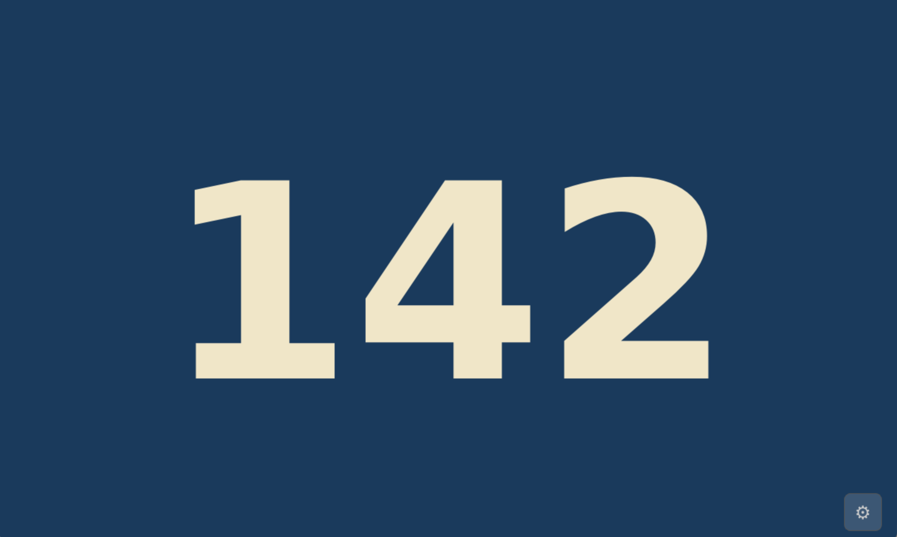

# SPAAC Show Page Number

Electronic display to show the congregation the current page number.
Also show when it is appropriate to stand, sit, or kneel.  A TV
remote directs the page number on the screen.

Implemented with a Raspberry Pi, 7" touchscreen display, IR receiver,
and a standard TV remote.

## Quick Start

1. Follow the [Installation Guide](docs/installation_guide.md) to assemble
   the hardware, flash the Pi, and deploy the software.
2. After first boot, open the Settings dialog (⚙ button, lower-right corner)
   and use **Teach Buttons** to map your TV remote's buttons to functions.
3. See the [User Guide](docs/user_guide.md) for day-to-day operation.
4. If something does not work, see the [Troubleshooting Guide](docs/troubleshooting.md).

## Documentation

| Document | Description |
|----------|-------------|
| [User Guide](docs/user_guide.md) | How to operate the display and remote |
| [Installation Guide](docs/installation_guide.md) | Parts list, hardware assembly, OS setup, service configuration |
| [Troubleshooting Guide](docs/troubleshooting.md) | Diagnosing IR receiver, service, and display problems |

## Source Files

| File | Description |
|------|-------------|
| `spaac_display.py` | Main Python application (PyQt5 + evdev) |
| `spaac.service` | systemd service unit — copy to `/etc/systemd/system/` |
| `stand.png` | Stick-figure icon for "Please Stand" posture cue (auto-generated on first run) |
| `sit.png` | Stick-figure icon for "Please Be Seated" posture cue (auto-generated on first run) |
| `kneel.png` | Stick-figure icon for "Please Kneel" posture cue (auto-generated on first run) |
| `Ararat-and-Khor-Virap.png` | Desktop wallpaper image |

